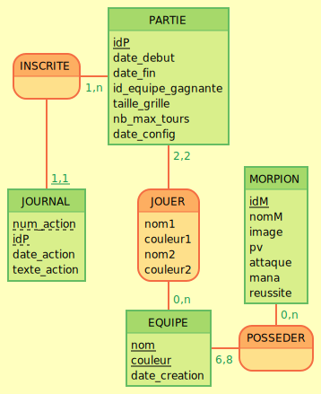

# Instructions pour un espace de travail

à faire avant de clone le repo (car il manque le serveur !)

```bash
curl https://perso.liris.cnrs.fr/fabien.duchateau/ens/BDW/tp/bdw-server.zip --output bdw.zip
mkdir nom_espace
python -m venv espace
source espace/bin/activate
cd websites
git clone git@github.com:Clownatique/phtirius-inguinalis.git
cd phtirius-inguinalis
```

à faire avant de coder: 

```bash
#on suppose donc être dans phtirius-inguinalis
git pull
```

après avoir codé:

```bash
git add .
git commit -m 'message' 
```
format des messages
nom de la sous/fonctionnalité codé, en précisant si il s'agit du modèle, de la vue ou du contrôlleur

# phtirius-inguinalis

## entité association 



## fonctionnalités

### accueil et statistiques

-  Top-3 des équipes avec le plus de victoires``
-  Partie la plus rapide et celle la plus longue``
-  Nombre moyen de lignes de journalisation, pour chaque couple (mois,`année).`

- [ ] vue templates/accueil/accueil.html + {{ block statistiques.html`}}`
- [ ] modèle``
- [ ] controlleur`controleurs/accueil/accueil.py`


le controleur accueil ne gère pour l'instant pas grand chose
il utilise un système de bloque pour scinder les statistiques en deux
### gestion des équipes

- [ ] faire le script pour remplir la bdd avec les morpions (avec les images)

#### créer une nouvelle équipe

- [ ] vue`templates/equipe/creation.html`
- [ ] modèle
- [ ] controlleur`controleurs/equipe/creation.py`

#### lister les équipes 

- [ ] vue`templates/equipe/lister.html`
- [ ] modèle
- [ ] controlleur`controleurs/equipe/lister.py`

### partie normale

#### pré partie

forms pour créer une instance partie

- [ ] vue`templates/partie_simple/creation.html`
- [ ] modèle
- [ ] controlleur`controleurs/partie/creation.py`

#### pendant la partie

La joueuse dont c’est le tour choisit un morpion de son équipe et une case libre où le placer ;

- [ ] vue`templates/partie_simple/jouer.html`
- [ ] modèle
- [ ] controlleur`controleurs/partie/jouer.py`

En somme, c une création d'action dans la base.
après avoir inséré l'action, vérifié si la partie est réussie. Si elle est
réussie, il suffit d'afficher la page de poste partie
donc c un form + une insertion + verification de si le coup n'est pas illégal

#### post partie

Je pensais à une bête variation de la page "pendant la partie"
(victoire, grille pleine, nombre de tours atteint).
- [ ] vue`templates/partie/resultat.html`
- [ ] modèle
- [ ] controleur`templates/partie_simple/resultat.py`

### partie avancée

Il faut donc réutiliser le même schéma 

### Préparation des livrables
- [ ] Une archive de votre site web, en zip ou rar (colonne archive_projet), qui contient a-minima :
– le répertoire de votre site (code complet, commenté et indenté, respectant l’arborescence de la section
2 et incluant votre fichier de configuration config.toml) ;
– les fichiers de conception de la BD, i.e., le diagramme entité/association (format png ou pdf), le
schéma relationnel sous forme textuelle (format txt, pdf, html, ou markdown) et le script SQL
exécutable de création de votre base de données avec des instances en nombre suffisant (format txt
ou sql).
- [ ] Une affiche en pdf, de 1 page maximum (colonne affiche_projet). notamment pour harmoniser
Sur cette affiche (au style graphique libre), vous mettrez :
– les noms et prénoms du binôme ;
– un résumé des fonctionnalités implémentées (e.g., sous forme de liste ou tableau) ;
– le diagramme entité/association ;
– des captures d’écran annotées de votre site.
